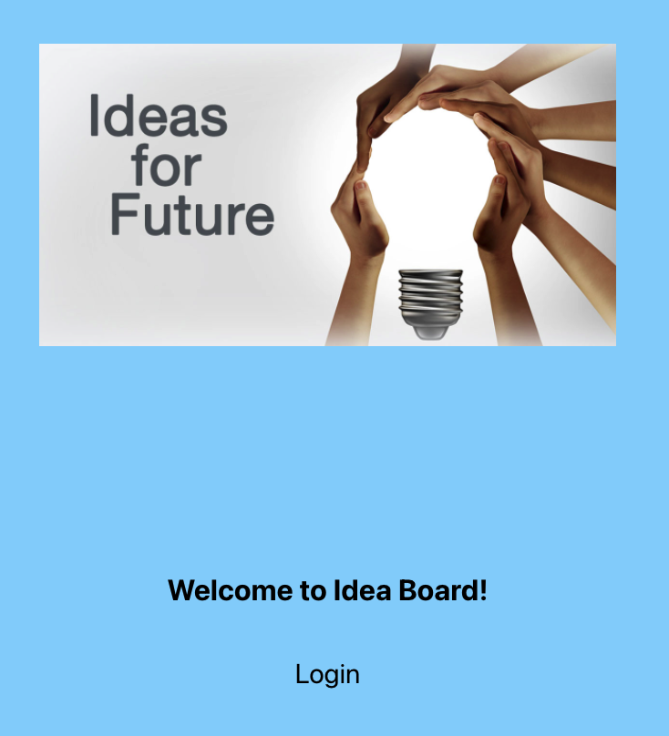
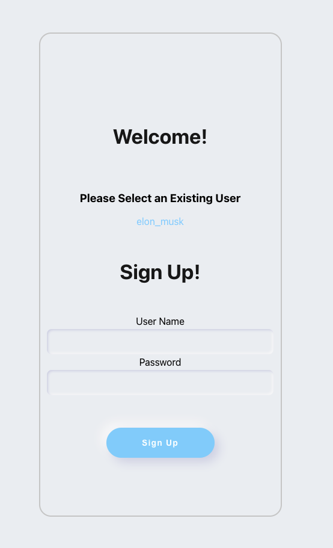
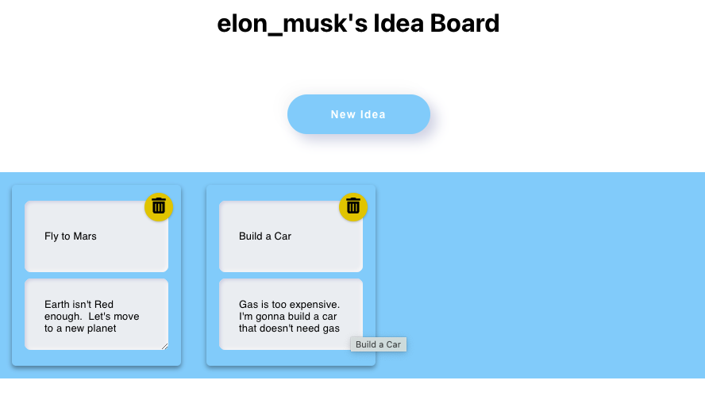

<h1>Idea Board</h1>

---

## Idea Board

This is an idea board with a pre-built back-end server where you can temporally save the users' id and password plus every user is able to add, edit and delete ideas from the board by selecting the user's link.

Work with your classmates and colleagues to:

- Sketch two projects.
- Write three ideas for each project.
- Illustrate with titles what your data model might look like.

You can see this project running [here](https://pipe-mv.github.io/ideas-board/).

---

### Setting Up

- Fork or clone this repository.

- You can run this with `npm install` and then run `npm run dev` in order to start the server first and finally `npm start` which will take you to the landing site.

---

- by pressing the `loging` you will go the login page where you can register you user id and password.

---

Note that the user have already some listed three ideas in the board that you can edit and delete as your convenience. That is to say, from a board that looks like this:

---
